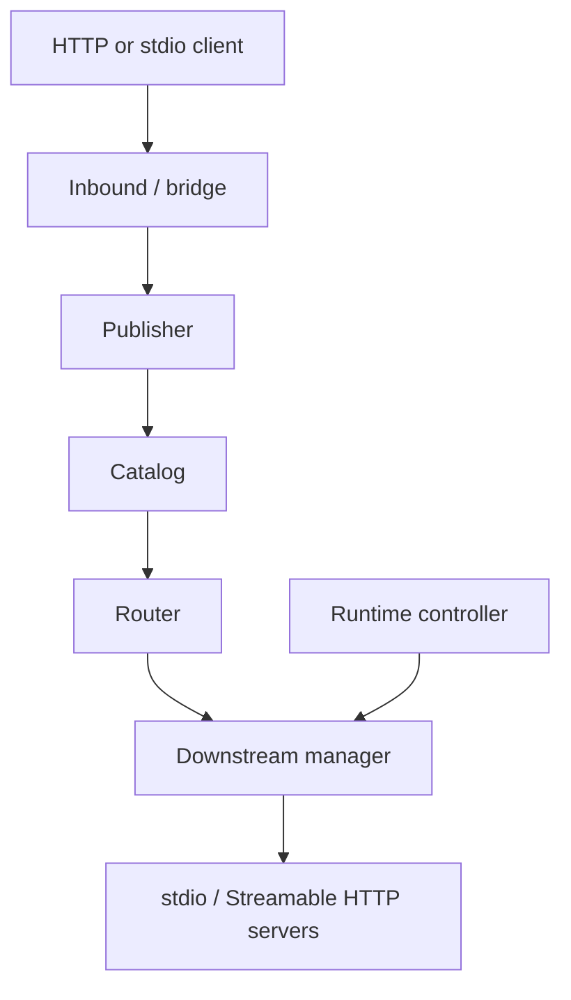

# MCP Hub

**English** | [简体中文](README.zh-CN.md)

MCP Hub is a single-binary personal MCP gateway for running, aggregating, routing, and managing multiple downstream MCP servers. Configure downstream services once, then expose one Streamable HTTP endpoint to IDEs, agents, HTTP MCP clients, and stdio-only clients.

Current source identity: **v0.4.0 release candidate**. A formal `v0.4.0` Git tag / GitHub Release has not been published yet.

Current technical baseline:

- Go directive: 1.25.0
- CI: Go 1.25.8 and 1.27.1 on Linux, Windows, and macOS
- MCP Go SDK: v1.7.0 in both production and the independent SDK probe
- production shape: one Go binary; no Node.js runtime dependency

Using SDK v1.7.0 does **not** mean MCP Hub claims complete native support for every MCP 2026-07-28 feature. See [compatibility](docs/COMPATIBILITY.md) for the tested protocol boundary.

## What it provides

- One `/mcp` endpoint with a dynamically updated tool catalog.
- Managed stdio children and remote Streamable HTTP downstreams.
- Stable public tool names and explicit, no-replay request routing.
- Strict, size-bounded JSON configuration.
- OS-backed config locking, ETag/CAS, durable atomic writes, rollback, and hot reload.
- Preflight validation before persisting new or connection-changing downstreams.
- POSIX process-group and Windows Job Object process-tree ownership.
- A responsive `/admin/` browser console.
- Remote Admin CLI: `list/get/add/edit/delete` downstream MCP services without SSH.
- `status`, `doctor`, `export`, and stdio bridge client workflows.
- Loopback-safe local mode and fail-closed authenticated public mode.
- An embedded `mcp-hub-deployer` Skill and copy-paste Agent deployment prompt.
- Cross-platform CI, race checks, SDK probe, Chromium regressions, real-Hub browser smoke, and `govulncheck`.

## Quick start

Building from source requires Go 1.25 or newer.

```bash
go build -trimpath -o mcp-hub ./cmd/mcp-hub
cp config.example.json config.json
./mcp-hub validate --config ./config.json
./mcp-hub serve --config ./config.json
```

Default MCP endpoint:

```text
http://127.0.0.1:8080/mcp
```

Inspect a running Hub:

```bash
./mcp-hub status --endpoint http://127.0.0.1:8080
./mcp-hub doctor --endpoint http://127.0.0.1:8080
```

For a public Hub, set `MCP_HUB_TOKEN` or pass `--token`. Prefer environment/secret storage on shared systems because command-line arguments may appear in process listings.

## Client access

HTTP-capable MCP clients should connect directly to:

```text
https://mcp.example.com/mcp
```

Clients that only support stdio can use the built-in bridge:

```bash
MCP_HUB_TOKEN='...' mcp-hub stdio --connect https://mcp.example.com/mcp
```

When a supported client-specific config is needed, prefer the current `mcp-hub export` command instead of relying on an old hand-written example.

## Remote downstream administration

Use the Admin token, not the MCP token:

```bash
export MCP_HUB_ADMIN_TOKEN='<ADMIN_TOKEN>'

./mcp-hub admin list --endpoint https://hub.example.com
./mcp-hub admin get remote-tools --endpoint https://hub.example.com
./mcp-hub admin add filesystem --file ./filesystem.json --endpoint https://hub.example.com
./mcp-hub admin edit filesystem --file ./filesystem.json --endpoint https://hub.example.com
./mcp-hub admin delete filesystem --endpoint https://hub.example.com --yes
```

Remote Admin reuses the same authenticated Admin session, CSRF, ETag/CAS, strict validation, downstream preflight, atomic persistence, reload, and rollback path as the browser console. Non-loopback plaintext HTTP and redirects are rejected.

See [Remote Admin CLI](docs/REMOTE-ADMIN.md) for server JSON format, secret handling, conflict semantics, exit behavior, and troubleshooting.

## Configuration

Configuration is strict JSON. Duplicate keys, unknown fields, wrong case, trailing values, invalid transport combinations, unsafe remote HTTP URLs, and unresolved required environment references are rejected.

```json
{
  "version": 1,
  "hub": { "listen": "127.0.0.1:8080" },
  "defaults": {
    "startupTimeout": "20s",
    "callTimeout": "60s",
    "maxConcurrency": 8
  },
  "mcpServers": {
    "memory": {
      "type": "stdio",
      "command": "npx",
      "args": ["-y", "@modelcontextprotocol/server-memory"]
    }
  }
}
```

stdio children inherit a safe compatibility environment baseline rather than the entire Hub environment. Forward required secrets explicitly through server `env`, preferably using `${NAME}` references.

See [configuration](docs/CONFIG.md).

## Admin console

Enable `hub.admin` to serve `/admin/`.

The management plane uses:

- bounded Admin sessions;
- `HttpOnly` / `SameSite=Strict` cookies and `Secure` cookies under HTTPS;
- exact same-origin checks;
- synchronizer CSRF tokens;
- login/API rate limits;
- secret placeholders;
- ETag/CAS conflict protection;
- connection-changing downstream preflight;
- shared config locking, atomic persistence, reload, and rollback.

The browser editor snapshots the config revision when it opens, so a later background refresh cannot silently authorize a stale draft against a newer revision. Slow PUT bodies are read before entering the shared configuration transaction lock.

See [console polish and verification](docs/CONSOLE-POLISH.md) and [security](docs/SECURITY.md).

## Public deployment

Recommended topology:

```text
Internet -> Caddy/Nginx HTTPS -> 127.0.0.1:8080 MCP Hub
```

Public mode is fail-closed and requires an HTTPS `publicUrl`, explicit `allowedHosts`, trusted proxy CIDRs, and separate strong MCP/Admin tokens. Do not expose Hub port 8080 directly to the Internet.

Use [VPS/public deployment](docs/VPS.md) and [`config.vps.example.json`](config.vps.example.json) as the baseline.

## Architecture



Configuration on disk remains the persistent source of truth. Browser Admin, Remote Admin CLI, and trusted Agent automation converge on the same server-side configuration transaction model rather than bypassing validation and CAS.

See [architecture](docs/ARCHITECTURE.md) and the current [development design](MCP-Hub-%E5%BC%80%E5%8F%91%E8%AE%BE%E8%AE%A1%E6%96%87%E6%A1%A3.md).

## Development and verification

Root module:

```bash
go test -count=1 -timeout 180s ./...
go test -race -count=1 -timeout 240s ./...
go vet ./...
node --check internal/admin/web/app.js
node --test internal/admin/webtest/*.test.mjs
go build -trimpath -o dist/mcp-hub ./cmd/mcp-hub
```

Independent SDK probe:

```bash
cd verification/sdkprobe
go test -race -count=1 -timeout 120s ./...
```

Chromium UI regressions:

```bash
cd internal/admin/browsertest
npm ci
npx playwright install --with-deps chromium
npm test
```

Real-Hub Chromium smoke from repository root:

```bash
go build -trimpath -o dist/mcp-hub ./cmd/mcp-hub
node internal/admin/browsertest/live-smoke.mjs
```

GitHub Actions runs Linux/Windows/macOS × Go 1.25.8/1.27.1 plus current-Go race/SDK checks, Linux browser/integration checks, and `govulncheck`.

Automated PASS does not certify every GUI MCP client, third-party MCP server, or reverse-proxy/TLS combination. See [implementation status](docs/IMPLEMENTATION-STATUS.md).

## Agent deployment assets

After Admin login, **Agent 自动部署** provides:

- a generated `skill.zip` containing the embedded `mcp-hub-deployer` Skill;
- a generic deployment prompt for agents that do not support Skills.

The Skill source lives under `internal/admin/agent-skill/` and is embedded into the binary so deployment guidance ships with the running version.

Maintainers should also read [Agent maintenance guide](MCP-Hub-Agent%E5%AE%9E%E6%96%BD%E6%89%8B%E5%86%8C.md).

## Release status

The repository contains a release workflow that:

1. verifies tag/source version agreement;
2. runs test/vet/SDK probe;
3. builds Linux, Windows, and macOS for amd64 and arm64;
4. injects commit/build-date metadata;
5. generates `SHA256SUMS`;
6. publishes a GitHub Release.

Until an exact `v0.4.0` tag and GitHub Release exist, the project should be described as **v0.4.0 release candidate**, not as a completed stable release.

## Documentation index

- [Configuration](docs/CONFIG.md)
- [Security model](docs/SECURITY.md)
- [Compatibility](docs/COMPATIBILITY.md)
- [VPS/public deployment](docs/VPS.md)
- [Remote Admin CLI](docs/REMOTE-ADMIN.md)
- [Architecture](docs/ARCHITECTURE.md)
- [Implementation / verification status](docs/IMPLEMENTATION-STATUS.md)
- [Admin console verification](docs/CONSOLE-POLISH.md)
- [SDK probe](verification/sdkprobe/README.md)
- [Current development design](MCP-Hub-%E5%BC%80%E5%8F%91%E8%AE%BE%E8%AE%A1%E6%96%87%E6%A1%A3.md)
- [Agent maintenance guide](MCP-Hub-Agent%E5%AE%9E%E6%96%BD%E6%89%8B%E5%86%8C.md)

`docs/HARDENING-VERIFICATION.md` is historical v0.3.1 evidence; its older measurements are not the current product contract.

## Security boundary

MCP Hub is a trusted personal gateway, not a sandbox. stdio downstreams execute with the Hub user's privileges. Run the service as a dedicated non-root user, keep credentials outside Git, and only configure MCP servers you trust.

See [security](docs/SECURITY.md) for the complete boundary.
