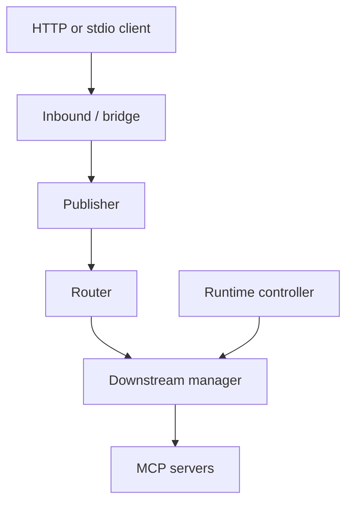

# MCP Hub

MCP Hub is a single-binary gateway for running and aggregating multiple MCP
servers. Configure downstream services once, then expose one Streamable HTTP
endpoint to IDEs, agents, and stdio-only clients.

The v0.4 release candidate builds on the v0.3 refactor with stricter runtime,
configuration, transport, process-lifecycle, and release engineering controls.
The admin console is usable in both local and reverse-proxied public mode, and
configuration changes that alter downstream connections are preflighted before
they are persisted.

## What it provides

- One `/mcp` endpoint with a dynamically updated tool catalog.
- Managed stdio children and remote Streamable HTTP downstreams.
- Stable public tool names and explicit, no-replay request routing.
- Strict, size-bounded JSON configuration with durable atomic compare-and-swap writes.
- Hot reload for downstream changes and restart detection for startup-bound settings.
- A responsive `/admin/` console for status, calls, server configuration, client access, and Agent deployment assets.
- An embedded `mcp-hub-deployer` Skill plus a copy-paste Agent prompt for repeatable server/client deployment, upgrades, verification, and recovery.
- Loopback-safe local mode and an explicit authenticated public mode.
- A stdio bridge for clients that cannot connect to HTTP MCP endpoints.

## Quick start

Build the binary and copy the example configuration:

```bash
go build -trimpath -o mcp-hub ./cmd/mcp-hub
cp config.example.json config.json
./mcp-hub validate --config ./config.json
./mcp-hub serve --config ./config.json
```

The default MCP endpoint is `http://127.0.0.1:8080/mcp`.

For a stdio-only client, generate a client entry:

```bash
./mcp-hub export \
  --client cursor \
  --transport stdio \
  --endpoint http://127.0.0.1:8080/mcp
```

Inspect a running Hub:

```bash
./mcp-hub status --endpoint http://127.0.0.1:8080
./mcp-hub doctor --endpoint http://127.0.0.1:8080
```

For a public Hub, set `MCP_HUB_TOKEN` or pass `--token` to `status`, `doctor`,
and `stdio`. Prefer the environment variable on shared machines because command
arguments may be visible in the process list.

Remote downstream administration is available from any MCP Hub client binary that
can reach the Admin endpoint. Use `MCP_HUB_ADMIN_TOKEN` (preferred) or `--token`:

```bash
export MCP_HUB_ADMIN_TOKEN='<ADMIN_TOKEN>'

./mcp-hub admin list --endpoint https://hub.example.com
./mcp-hub admin get remote-tools --endpoint https://hub.example.com
./mcp-hub admin add filesystem --file ./filesystem.json --endpoint https://hub.example.com
./mcp-hub admin edit filesystem --file ./filesystem.json --endpoint https://hub.example.com
./mcp-hub admin delete filesystem --endpoint https://hub.example.com --yes
```

`admin add/edit/delete` reuse the same authenticated Admin API, ETag/CAS conflict
checks, strict validation, preflight, atomic persistence, rollback, and hot reload
path as the browser console. Remote plaintext HTTP is rejected; loopback HTTP is
allowed for local development.

## Configuration

Configuration is strict JSON. Duplicate keys, unknown fields, trailing values,
invalid transport combinations, unsafe remote HTTP URLs, and missing environment
references are rejected before listeners or child processes are started.

```json
{
  "version": 1,
  "hub": { "listen": "127.0.0.1:8080" },
  "defaults": {
    "startupTimeout": "20s",
    "callTimeout": "60s",
    "maxConcurrency": 8
  },
  "mcpServers": {
    "memory": {
      "type": "stdio",
      "command": "npx",
      "args": ["-y", "@modelcontextprotocol/server-memory"]
    }
  }
}
```

See [configuration](docs/CONFIG.md) for every field and reload rule.

## Admin console and public deployment

Enable `hub.admin` to serve the embedded management console at `/admin/`. Admin
sessions use HttpOnly/SameSite cookies, synchronizer CSRF tokens, strict origin
checks, bounded login/API rates, secret placeholders, and ETag/CAS writes.

After signing in, the **Agent 自动部署** section exposes two authenticated deployment aids:

- download a generated `skill.zip` containing the embedded `mcp-hub-deployer` Skill;
- copy a generic Agent deployment prompt for agents that do not support Skills.

The Skill source lives under `internal/admin/agent-skill/` and is compiled into the
single MCP Hub binary, so the management page always serves the deployment guidance
that shipped with that binary rather than a separately hosted artifact.

Public deployment is fail-closed. It requires `hub.publicMode`, an HTTPS
`publicUrl`, an `allowedHosts` list, trusted reverse-proxy CIDRs, and separate MCP
and admin tokens of at least 32 characters each. The Hub may still listen on
loopback behind Caddy or Nginx.

Use [the VPS deployment guide](docs/VPS.md) and
[`config.vps.example.json`](config.vps.example.json) as the baseline.

## Architecture



Configuration on disk remains the source of truth. The runtime controller
applies only validated, resolved snapshots and retains the last healthy runtime
when an edited file is invalid. See [architecture](docs/ARCHITECTURE.md) for
package boundaries and invariants.

## Development and verification

The module currently keeps Go 1.25 compatibility while CI exercises both the
compatibility floor and current Go across Linux, Windows, and macOS. Current-Go
jobs also run the race detector and independent SDK probe, and CI includes a
`govulncheck` gate. The production binary has no Node.js runtime dependency. Pure
helper tests use Node without dependencies; optional Chromium UI regressions use a pinned
Playwright development dependency.

```bash
go test -count=1 -timeout 180s ./...
go test -race -count=1 -timeout 180s ./...
go vet ./...
node --check internal/admin/web/app.js
node --test internal/admin/webtest/*.test.mjs
go build -trimpath -ldflags="-s -w" -o dist/mcp-hub ./cmd/mcp-hub
```

Chromium UI regressions (production DOM/modules, **stubbed admin API**):

```bash
cd internal/admin/browsertest
npm ci
npx playwright install --with-deps chromium
npm test
```

These tests check browser interactions and outgoing payloads, not real-backend
cookie issuance, CSRF enforcement, or disk/runtime persistence. Those boundaries
need the Go API tests and the narrower integrated smoke test below. It runs a
real local Hub with disabled fixture downstreams (no third-party processes),
verifies login cookies, editing/JSON payload persistence, secret duplication,
and missing-CSRF rejection:

```bash
# From repository root, after installing the browser dependencies above:
go build -trimpath -o dist/mcp-hub ./cmd/mcp-hub
node internal/admin/browsertest/live-smoke.mjs
```

This is not a reverse-proxy/public-mode or GUI MCP-client compatibility test.

The independent SDK probe lives in `verification/sdkprobe` and must be tested
from that directory. GitHub Actions runs Go tests, race tests, vet, the SDK
probe, builds, and the admin UI tests.

Automated Linux, Windows, and macOS verification does not prove compatibility
with every third-party MCP server or GUI client. The exact evidence boundary is
tracked in [implementation status](docs/IMPLEMENTATION-STATUS.md).

## Security boundary

MCP Hub is a trusted personal gateway, not a sandbox. stdio downstreams execute
with the Hub user's privileges. Run the service as a dedicated non-root user,
keep tokens in environment variables, and only configure MCP servers you trust.

See [security](docs/SECURITY.md) for the complete boundary and operational
guidance.