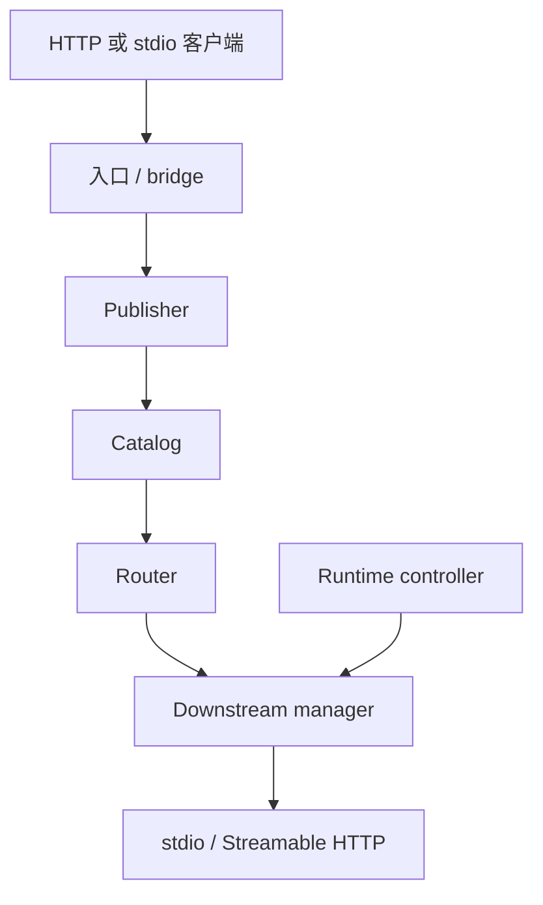

# MCP Hub

[English](README.md) | **简体中文**

MCP Hub 是一个单二进制个人 MCP 网关，用于集中运行、聚合、路由和管理多个下游 MCP 服务。下游只需要配置一次，即可通过统一的 Streamable HTTP `/mcp` 入口供 IDE、Agent、HTTP MCP 客户端以及仅支持 stdio 的客户端使用。

当前源码身份：**v0.4.0 release candidate**。在正式 `v0.4.0` Git Tag 与 GitHub Release 发布之前，不应把它描述成已经正式发布的稳定版。

当前技术基线：

- Go directive：1.25.0
- CI：Linux / Windows / macOS 上的 Go 1.25.8 与 1.27.1
- MCP Go SDK：生产模块和独立 SDK probe 都为 v1.7.0
- 生产形态：单 Go 二进制，不依赖 Node.js 运行时

使用 SDK v1.7.0 **不代表** MCP Hub 宣称完整原生支持 MCP 2026-07-28 的所有能力。实际协议边界见[兼容性说明](docs/COMPATIBILITY.md)。

## 核心能力

- 一个 `/mcp` 入口与动态工具目录；
- 管理本地 stdio 与远程 Streamable HTTP downstream；
- 稳定公开工具名与明确、无自动重放的调用路由；
- 严格且有大小限制的 JSON 配置；
- OS-backed 配置锁、ETag/CAS、持久化原子写入、回滚与热重载；
- 新建/连接级修改在落盘前执行 downstream preflight；
- POSIX process group 与 Windows Job Object 进程树管理；
- 响应式 `/admin/` 管理台；
- 远程 Admin CLI，可在客户端直接 `list/get/add/edit/delete` 服务端下游 MCP；
- `status` / `doctor` / `export` / stdio bridge；
- 安全的本地回环模式与 fail-closed 公网模式；
- 内置 `mcp-hub-deployer` Skill 与 Agent Prompt；
- 跨平台 CI、race、SDK probe、Chromium 回归、真实 Hub 浏览器 smoke 与 `govulncheck`。

## 快速开始

从源码构建需要 Go 1.25 或更新版本：

```bash
go build -trimpath -o mcp-hub ./cmd/mcp-hub
cp config.example.json config.json
./mcp-hub validate --config ./config.json
./mcp-hub serve --config ./config.json
```

默认 MCP 地址：

```text
http://127.0.0.1:8080/mcp
```

检查运行中的 Hub：

```bash
./mcp-hub status --endpoint http://127.0.0.1:8080
./mcp-hub doctor --endpoint http://127.0.0.1:8080
```

公网 Hub 使用 `MCP_HUB_TOKEN` 或 `--token`。共享机器上优先使用环境变量或 Secret 存储，因为命令行参数可能出现在进程列表里。

## 客户端接入

原生支持 HTTP MCP 的客户端优先直接连接：

```text
https://mcp.example.com/mcp
```

仅支持 stdio 的客户端使用内置 bridge：

```bash
MCP_HUB_TOKEN='...' mcp-hub stdio --connect https://mcp.example.com/mcp
```

需要生成特定客户端配置时，优先使用当前 `mcp-hub export`，不要长期依赖早期手写格式。

## 远程管理服务端下游 MCP

这里使用 **Admin Token**，不是 MCP Token：

```bash
export MCP_HUB_ADMIN_TOKEN='<ADMIN_TOKEN>'

./mcp-hub admin list --endpoint https://hub.example.com
./mcp-hub admin get remote-tools --endpoint https://hub.example.com
./mcp-hub admin add filesystem --file ./filesystem.json --endpoint https://hub.example.com
./mcp-hub admin edit filesystem --file ./filesystem.json --endpoint https://hub.example.com
./mcp-hub admin delete filesystem --endpoint https://hub.example.com --yes
```

Remote Admin 与浏览器管理台复用同一套：

- Admin session；
- CSRF；
- ETag/CAS；
- strict validation；
- downstream preflight；
- 原子持久化；
- runtime reload；
- rollback / last healthy state。

远程非 loopback 明文 HTTP 和 redirect 会被拒绝。

完整 `server.json` 格式、Secret 处理、并发冲突、退出码和排错见 [Remote Admin CLI](docs/REMOTE-ADMIN.md)。

## 配置

配置采用严格 JSON。重复键、未知字段、字段大小写错误、尾随内容、无效 transport 组合、不安全远程 HTTP URL，以及必须存在但未解析的环境变量引用都会被拒绝。

```json
{
  "version": 1,
  "hub": { "listen": "127.0.0.1:8080" },
  "defaults": {
    "startupTimeout": "20s",
    "callTimeout": "60s",
    "maxConcurrency": 8
  },
  "mcpServers": {
    "memory": {
      "type": "stdio",
      "command": "npx",
      "args": ["-y", "@modelcontextprotocol/server-memory"]
    }
  }
}
```

stdio 子进程只继承安全兼容环境基线，不再继承整个 Hub 环境。需要的额外值应通过 server `env` 显式转发，Secret 优先使用 `${NAME}` 引用。

完整字段见[配置文档](docs/CONFIG.md)。

## 管理台

启用 `hub.admin` 后通过 `/admin/` 使用管理台。

管理面包括：

- 有上限的 Admin session；
- `HttpOnly` / `SameSite=Strict` Cookie，HTTPS 下使用 `Secure`；
- exact same-origin；
- synchronizer CSRF；
- 登录/API 限流；
- Secret placeholder；
- ETag/CAS 并发保护；
- connection-changing edit preflight；
- 共享配置锁、原子持久化、reload 与 rollback。

浏览器编辑器会在打开时固定配置 revision，因此后台刷新不会让旧草稿偷偷拿到新 ETag。Admin PUT 的网络 Body 会先受限读取，再进入共享配置事务锁，避免慢上传阻塞 runtime polling。

详见[管理台优化与验证](docs/CONSOLE-POLISH.md)和[安全模型](docs/SECURITY.md)。

## 公网部署

推荐拓扑：

```text
Internet -> Caddy/Nginx HTTPS -> 127.0.0.1:8080 MCP Hub
```

公网模式采用 fail-closed 设计，需要 HTTPS `publicUrl`、明确 `allowedHosts`、可信代理 CIDR，以及不同的强 MCP/Admin Token。不要把 Hub 8080 直接暴露到公网。

以 [VPS/公网部署指南](docs/VPS.md)和 [`config.vps.example.json`](config.vps.example.json) 为基线。

## 架构



磁盘 JSON 配置仍是持久化事实来源。Browser Admin、Remote Admin CLI 和受信 Agent 自动化最终都走服务端同一套配置事务路径，不通过旁路绕过验证和 CAS。

详见[架构文档](docs/ARCHITECTURE.md)和当前[开发设计文档](MCP-Hub-%E5%BC%80%E5%8F%91%E8%AE%BE%E8%AE%A1%E6%96%87%E6%A1%A3.md)。

## 开发与验证

根模块：

```bash
go test -count=1 -timeout 180s ./...
go test -race -count=1 -timeout 240s ./...
go vet ./...
node --check internal/admin/web/app.js
node --test internal/admin/webtest/*.test.mjs
go build -trimpath -o dist/mcp-hub ./cmd/mcp-hub
```

独立 SDK probe：

```bash
cd verification/sdkprobe
go test -race -count=1 -timeout 120s ./...
```

Chromium UI 回归：

```bash
cd internal/admin/browsertest
npm ci
npx playwright install --with-deps chromium
npm test
```

真实 Hub 浏览器 smoke：

```bash
go build -trimpath -o dist/mcp-hub ./cmd/mcp-hub
node internal/admin/browsertest/live-smoke.mjs
```

GitHub Actions 当前覆盖 Linux/Windows/macOS × Go 1.25.8/1.27.1，并在 current Go 上增加 race/SDK probe；Linux 还跑浏览器与 real-Hub smoke，另有 `govulncheck`。

自动化 PASS 不等于所有 GUI MCP 客户端、第三方 MCP 服务和反向代理/TLS 组合都完成认证。精确边界见[实现状态](docs/IMPLEMENTATION-STATUS.md)。

## Agent 自动部署

登录 Admin 后的 **Agent 自动部署** 区域提供：

- 内置 `mcp-hub-deployer` Skill 的 `skill.zip`；
- 给不支持 Skill 的 Agent 使用的通用部署 Prompt。

Skill 源码位于 `internal/admin/agent-skill/`，随二进制一起嵌入，因此管理台下载到的指导与当前运行版本配套。

维护者建议阅读 [Agent 维护与实施手册](MCP-Hub-Agent%E5%AE%9E%E6%96%BD%E6%89%8B%E5%86%8C.md)。

## Release 状态

仓库已经实现 Release workflow，可：

1. 校验 Tag 与源码版本；
2. 运行 test/vet/SDK probe；
3. 构建 Linux / Windows / macOS × amd64 / arm64；
4. 注入 commit / build date；
5. 生成 `SHA256SUMS`；
6. 创建 GitHub Release。

在正式 `v0.4.0` Tag 与 GitHub Release 出现之前，项目应继续称为 **v0.4.0 release candidate**。

## 文档索引

- [配置参考](docs/CONFIG.md)
- [安全模型](docs/SECURITY.md)
- [兼容性说明](docs/COMPATIBILITY.md)
- [VPS/公网部署](docs/VPS.md)
- [Remote Admin CLI](docs/REMOTE-ADMIN.md)
- [架构说明](docs/ARCHITECTURE.md)
- [实现状态与验证边界](docs/IMPLEMENTATION-STATUS.md)
- [管理台优化与验证](docs/CONSOLE-POLISH.md)
- [SDK probe](verification/sdkprobe/README.md)
- [当前开发设计](MCP-Hub-%E5%BC%80%E5%8F%91%E8%AE%BE%E8%AE%A1%E6%96%87%E6%A1%A3.md)
- [Agent 维护与实施手册](MCP-Hub-Agent%E5%AE%9E%E6%96%BD%E6%89%8B%E5%86%8C.md)

`docs/HARDENING-VERIFICATION.md` 是 v0.3.1 的历史验证材料，里面的旧版本和旧边界不再代表当前产品契约。

## 安全边界

MCP Hub 是可信个人网关，**不是沙箱**。stdio downstream 以 Hub 运行用户权限执行。建议使用专用非 root 用户运行，把凭据放在 Git 之外，并且只配置你信任的 MCP 服务。

完整边界见[安全文档](docs/SECURITY.md)。
