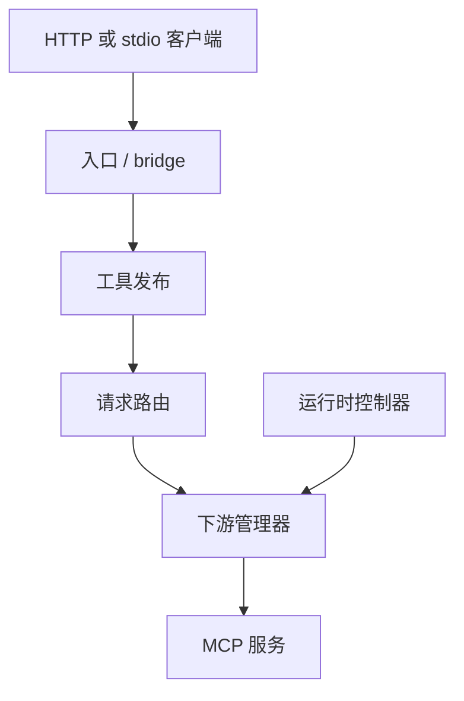

# MCP Hub

[English](README.md) | **简体中文**

MCP Hub 是一个以**单个二进制文件**运行的 MCP 网关，用于集中启动、管理和聚合多个 MCP 服务。下游服务只需配置一次，即可通过统一的 Streamable HTTP 入口接入 IDE、Agent，以及仅支持 stdio 的客户端。

当前 v0.4 发布候选版在 v0.3 重构基础上，加强了运行时、配置、传输、进程生命周期和发布验证。管理台同时支持本地模式与 HTTPS 反向代理下的公网模式；会改变下游连接的配置，在持久化前执行预检。

## 核心功能

- 统一的 `/mcp` 入口，动态更新工具目录。
- 管理本地 stdio 子进程及远程 Streamable HTTP 下游服务。
- 稳定的公开工具名称，明确的请求路由，不自动重放调用。
- 严格且有大小限制的 JSON 配置，支持持久化原子写入与 CAS 并发冲突检查。
- 下游配置热重载；监听、认证等启动绑定配置变更时提示需要重启。
- 内置响应式 `/admin/` 管理台：运行概览、服务配置、调用记录、客户端接入与 Agent 部署资源。
- 内置 `mcp-hub-deployer` Skill 和可复制的 Agent Prompt，覆盖部署、升级、验证和恢复。
- 默认安全的本地回环模式，以及显式启用认证的公网模式。
- stdio bridge，让仅支持本地 stdio 的客户端也能连接远程 Hub。

## 快速开始

从源码构建需要 Go 1.25 或更新版本；运行构建好的 Hub 不需要 Node.js。下游 MCP 服务可能有自己的 Node.js、Python 或其他依赖，例如下面的 `npx` 示例需要 Node.js/npm。

在仓库根目录构建，复制并验证示例配置：

```bash
go build -trimpath -o mcp-hub ./cmd/mcp-hub
cp config.example.json config.json
./mcp-hub validate --config ./config.json
./mcp-hub serve --config ./config.json
```

默认 MCP 地址为 `http://127.0.0.1:8080/mcp`。

为仅支持 stdio 的客户端生成配置：

```bash
./mcp-hub export \
  --client cursor \
  --transport stdio \
  --endpoint http://127.0.0.1:8080/mcp
```

检查正在运行的 Hub：

```bash
./mcp-hub status --endpoint http://127.0.0.1:8080
./mcp-hub doctor --endpoint http://127.0.0.1:8080
```

连接公网 Hub 时，为 `status`、`doctor` 和 `stdio` 设置 `MCP_HUB_TOKEN`，或传入 `--token`。共享机器上优先使用环境变量，因为命令行参数可能出现在进程列表中。

## 远程管理下游服务

只要能访问 Admin 入口，就可以使用 MCP Hub 客户端二进制远程管理下游。优先使用 `MCP_HUB_ADMIN_TOKEN` 环境变量，也支持 `--token`：

```bash
export MCP_HUB_ADMIN_TOKEN='<ADMIN_TOKEN>'

./mcp-hub admin list --endpoint https://hub.example.com
./mcp-hub admin get remote-tools --endpoint https://hub.example.com
./mcp-hub admin add filesystem --file ./filesystem.json --endpoint https://hub.example.com
./mcp-hub admin edit filesystem --file ./filesystem.json --endpoint https://hub.example.com
./mcp-hub admin delete filesystem --endpoint https://hub.example.com --yes
```

`admin add/edit/delete` 复用浏览器管理台使用的认证 Admin API、ETag/CAS 冲突检查、严格校验、预检、原子持久化、回滚和热重载流程。拒绝远程明文 HTTP；本地开发允许回环 HTTP。

## 配置

配置采用严格 JSON：重复键、未知字段、尾随内容、无效的传输配置组合、不安全的远程 HTTP URL，以及缺失的环境变量引用，都会在启动监听或子进程前被拒绝。

```json
{
  "version": 1,
  "hub": { "listen": "127.0.0.1:8080" },
  "defaults": {
    "startupTimeout": "20s",
    "callTimeout": "60s",
    "maxConcurrency": 8
  },
  "mcpServers": {
    "memory": {
      "type": "stdio",
      "command": "npx",
      "args": ["-y", "@modelcontextprotocol/server-memory"]
    }
  }
}
```

完整字段与重载规则见[配置文档](docs/CONFIG.md)。

## 管理台与公网部署

配置 `hub.admin` 后，可通过 `/admin/` 使用嵌入式管理台。管理会话使用 HttpOnly/SameSite Cookie、同步 CSRF Token、严格来源检查、受限的登录/API 请求速率、Secret 占位符及 ETag/CAS 写入。

管理台采用**深色导航 + 浅色工作区**，统一展示指标、下游服务、调用记录和客户端接入配置。支持桌面与手机布局、键盘焦点和系统减少动画偏好；窄屏调用表格保留全部列，在表格内横向滚动查看。

编辑器会保留打开时的配置版本，避免后台刷新把旧草稿与新版本号混用。配置内容与 ETag 仅在完整刷新成功后一起更新；刷新或退出失败会明确提示。慢速配置上传不会在读取请求体期间占用共享配置事务锁。详见[管理台优化与验证记录](docs/CONSOLE-POLISH.md)。

登录后的 **Agent 自动部署** 区域提供：

- 下载包含 `mcp-hub-deployer` Skill 的 `skill.zip`；
- 复制通用部署 Prompt，供不支持 Skill 的 Agent 使用。

Skill 源码位于 `internal/admin/agent-skill/`，随 Hub 一起编译进二进制，管理台提供的部署指导与运行版本配套，不依赖单独托管的资源。

公网部署遵循安全条件不满足就拒绝启动的原则，需要显式配置 `hub.publicMode`、HTTPS `publicUrl`、`allowedHosts`、可信反向代理 CIDR，以及**不同且各至少 32 字符**的 MCP 和 Admin Token。Hub 可以继续只监听回环地址，由 Caddy 或 Nginx 提供 HTTPS 反代。

请以 [VPS 部署指南](docs/VPS.md)和 [`config.vps.example.json`](config.vps.example.json) 为基线。MCP Token 用于客户端调用，Admin Token 用于管理，二者不能混用。

## 架构



磁盘上的配置是事实来源。运行时控制器只应用已校验、已解析的快照；编辑后的文件无效时，保留最近健康的运行时状态。模块职责及不变量见[架构文档](docs/ARCHITECTURE.md)。

## 开发与验证

模块保留 Go 1.25 兼容性，CI 在 Linux、Windows 和 macOS 上覆盖兼容基线与当前 Go。当前 Go 任务还运行 race 检测和独立 SDK 探针，并设有 `govulncheck` 漏洞扫描关卡。

生产二进制不依赖 Node.js。纯前端辅助测试只需要 Node；Chromium 回归使用锁定版本的 Playwright 开发依赖。

```bash
go test -count=1 -timeout 180s ./...
go test -race -count=1 -timeout 180s ./...
go vet ./...
node --check internal/admin/web/app.js
node --test internal/admin/webtest/*.test.mjs
go build -trimpath -ldflags="-s -w" -o dist/mcp-hub ./cmd/mcp-hub
```

Chromium 测试使用真实生产 DOM/模块，**Admin API 为测试桩**：

```bash
cd internal/admin/browsertest
npm ci
npx playwright install --with-deps chromium
npm test
```

`npm test` 串行运行交互与设计回归，覆盖编辑版本一致性、错误处理、无障碍和 320/390/768/1024/1440px 布局。它们验证浏览器行为与请求载荷，不能替代后端 Cookie 签发、CSRF 强制检查和配置落盘验证。

真实后端联调使用以下独立冒烟测试。它启动本地 Hub，使用禁用的测试下游，不启动第三方 MCP 进程，验证登录 Cookie、表单/JSON 参数持久化、Secret 保留与复制，以及缺失 CSRF 时的拒绝行为：

```bash
# 回到仓库根目录，确保已安装上述浏览器依赖
go build -trimpath -o dist/mcp-hub ./cmd/mcp-hub
node internal/admin/browsertest/live-smoke.mjs
```

独立 SDK 探针需要在自己的目录运行：

```bash
cd verification/sdkprobe
go test -race -count=1 -timeout 120s ./...
```

上述自动化验证**不等于**对所有第三方 MCP 服务、Cursor/Claude Desktop 等 GUI 客户端或所有公网反代组合的完整兼容认证。具体证据边界见[实现状态](docs/IMPLEMENTATION-STATUS.md)。

## 文档索引

- [配置参考](docs/CONFIG.md)
- [VPS 部署](docs/VPS.md)
- [架构说明](docs/ARCHITECTURE.md)
- [安全边界](docs/SECURITY.md)
- [兼容性说明](docs/COMPATIBILITY.md)
- [实现状态与验证边界](docs/IMPLEMENTATION-STATUS.md)
- [管理台优化与验证](docs/CONSOLE-POLISH.md)

以上专题文档目前主要为英文；本页为中文项目入口。

## 安全边界

MCP Hub 是可信个人网关，**不是沙箱**。stdio 下游会以 Hub 运行用户的权限执行。建议使用专用非 root 用户运行、通过环境变量提供 Token，并且只配置你信任的 MCP 服务。

完整边界及运维建议见[安全文档](docs/SECURITY.md)。
